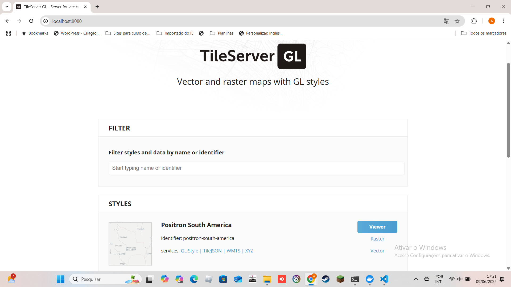
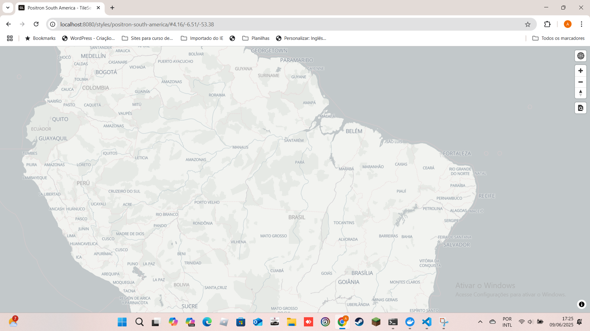
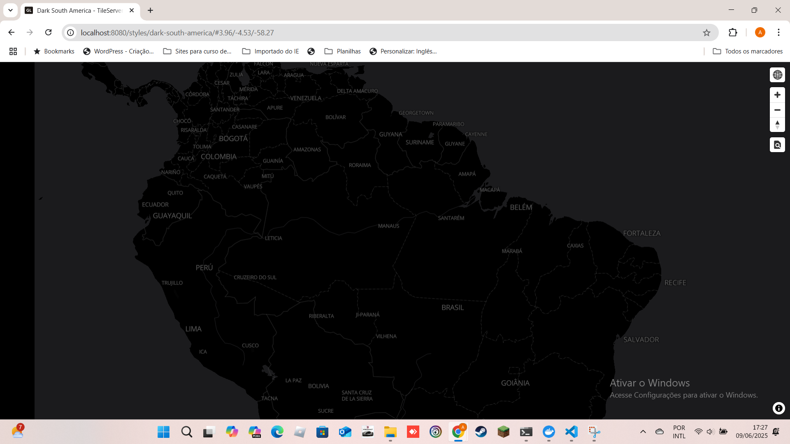
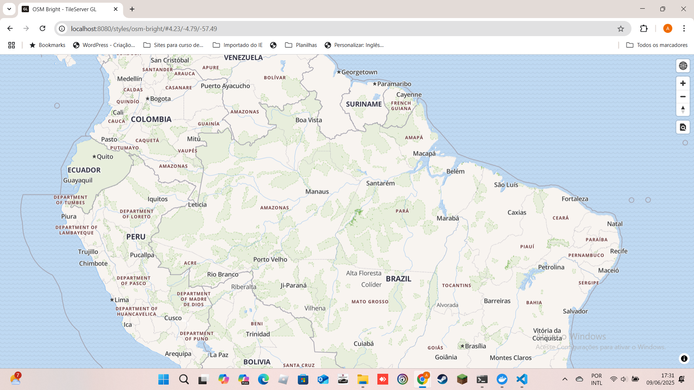
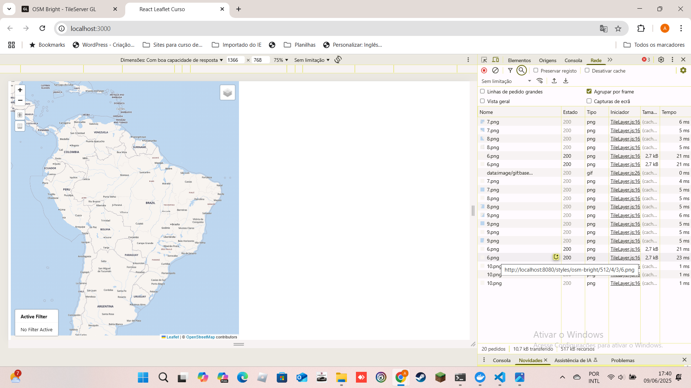

# tileserver-gl

Mapas vetoriais e raster com estilos GL. Renderização do lado do servidor pelo MapLibre GL Native. Servidor de blocos de mapas para MapLibre GL JS, Android, iOS, Leaflet, OpenLayers, GIS via WMTS, etc.

|Aplicação|Mapa Positron América do Sul|
|----|----|
|||

|Mapa Dark América do Sul|Mapa OSM Bright América do Sul|
|----|----|
|||

|Consumindo mapa com react-leaflet|
|----|
||

## ✔️ Link TileServer GL
`https://github.com/maptiler/tileserver-gl`

## 🔨 Estilização
Para criar arquivo de estilização do mapa `https://maputnik.github.io/`.

## 🛠️ Abrir e rodar o projeto

É necessário fazer o download do mapa no https://data.maptiler.com/downloads/planet/ ou em https://www.tilea.io/free-downloads , e colocar o arquivo `.mbtiles` dentro da pasta data e no arquivo `config.json` altera o `"mbtiles:"` para o nome do arquivo de mapa  `"mbtiles": exemplo.mbtiles` .

Dentro da pasta do projeto execute `docker compose up` , é necessário instalar docker na máquina e docker compose, o aplicativo Docker Desktop, já tem o plugin do docker compose instalado.

Depois, acesse <a href="http://localhost:8080/" target="_blank">http://localhost:8080/</a> no seu navegador. 